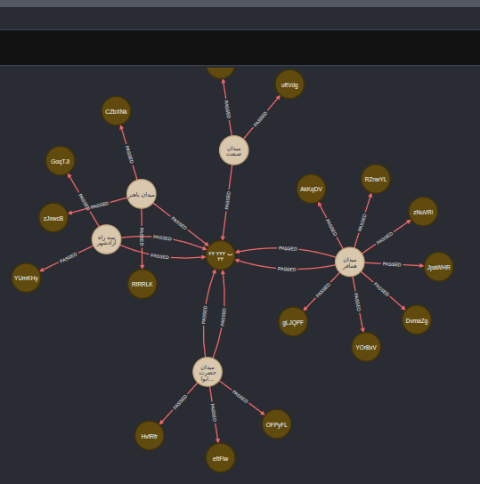
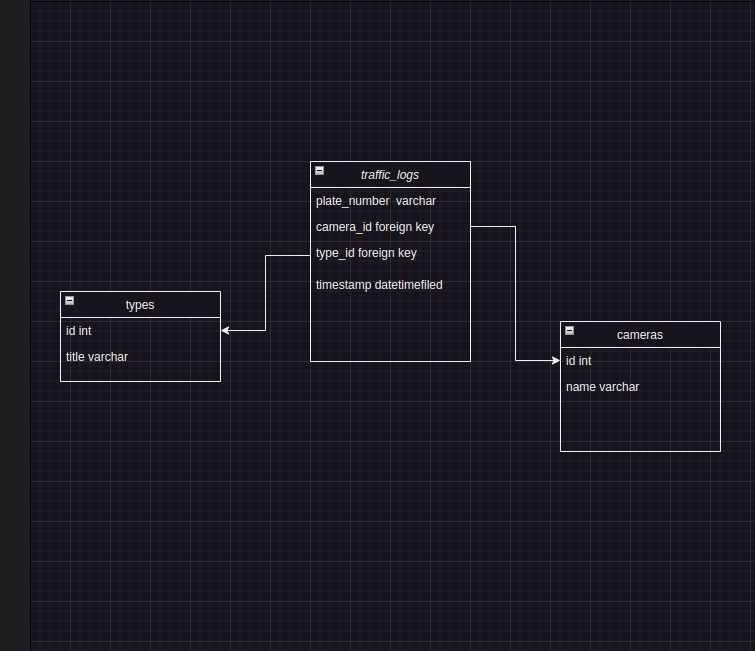

# Hello Guys...


## Guideline
- [Guideline](#guideline)
- [Goal](#goal)
- [Demo](#demo)
- [Installation](#installation)
- [Getting Started](#getting-started)
- [Database Schema](#database-schema)

# Goal

Hello, the goal of this project is to record and monitor traffic.

# Demo


# DataBase Schema


# Getting Started
```

git clone https://github.com/FahimReza1386/Urban-traffic-monitoring.git

```
# Installation
```
docker compose up --build -d

docker compose exec backend python manage.py makemigrations

docker compose exec backend python manage.py runserver
```
# How to Create Traffic Data
go to :

```

 http://127.0.0.1:8000/api/swagger

```
- Create a camera : /api/traffic/camera/create
- created traffic by url : /api/traffic/log/create

To get traffic information :
- getting traffic by url : /api/traffic/log/list :

you must enter the plate_number .

## Goodbye 👋

Thank you for checking out my project!